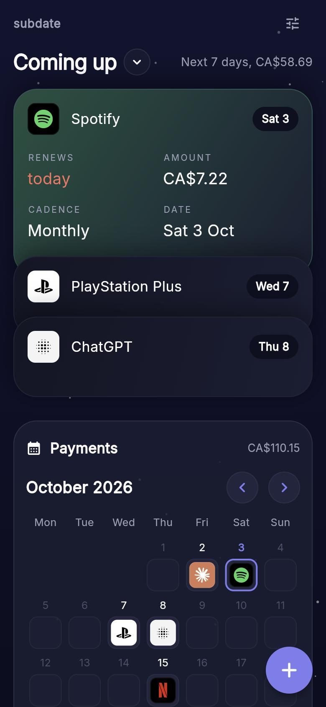

# subdate

tracks your subscriptions so you stop getting surprised by charges. flutter, runs on ios / android / web.



try it in the browser: https://lwwdev.github.io/subdate/

## what it does

- "coming up" stack for the next 7 / 14 / 30 days, total converted to your home currency
- calendar view of the month with the service icons on renewal days
- add / edit / delete subs, weekly / monthly / quarterly / yearly (or every N of those)
- a bunch of built-in brand icons, or use your own image
- mixed currencies, converted with ECB rates from [frankfurter](https://frankfurter.dev)
- local reminders before something renews (ios + android)
- free trials (reminds you before the first real charge) and pausing subs
- spending breakdown per month / year, split by category
- full list with search, sort and category filter
- backup + restore as json through the clipboard
- everything stays on your device (hive), no account

## run it

```
flutter pub get
flutter run            # pick a device
flutter run -d chrome  # web
flutter test
```

android needs the SDK, ios needs xcode + cocoapods, the usual

no mac? every push to main builds an apk and an unsigned ios build in CI, grab them from the
run's artifacts on the actions tab. the unsigned .ipa needs re-signing (sideloadly, altstore etc) before it installs.
the web build gets deployed to github pages from the same run.

## ios / testflight

the `testflight` workflow builds, signs and uploads to app store connect without a mac. one-time setup:

1. join the apple developer program and create the app in app store connect with bundle id `dev.lwwdev.subdate`
2. app store connect > users and access > integrations > team keys: make a key with the **admin** role
   (needed so xcode can create the certs/profiles itself), download the .p8
3. add repo secrets (settings > secrets and variables > actions):
   - `APPSTORE_KEY_ID` - the key id
   - `APPSTORE_ISSUER_ID` - issuer id shown above the keys list
   - `APPSTORE_KEY_P8` - the whole contents of the .p8 file
   - `APPLE_TEAM_ID` - from developer.apple.com > membership
4. actions tab > testflight > run workflow. the build shows up in testflight ~15 min later

## stack

riverpod, hive_ce, flutter_local_notifications, simple_icons, intl

brand icons come from [simple icons](https://simpleicons.org) (CC0), the logos belong to their owners obviously

## license

MIT
